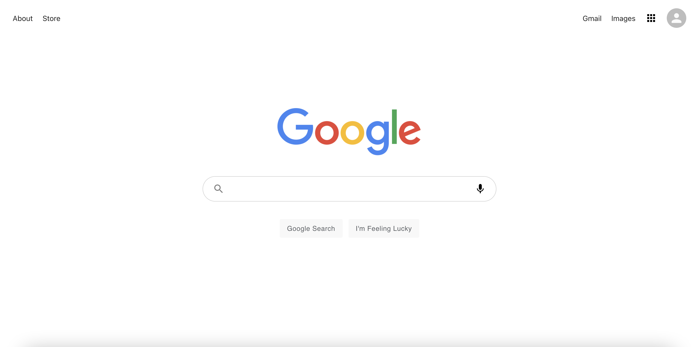

# Google Clone

## Description

Need to google something? Find what your looking for with this google clone application built with React.js.

## Table of Contents

- [Description](#description)
- [Technology](#technology)
- [User Story](#user-story)
- [Installation](#installation)
- [Usage](#usage)
- [License](#license)
- [Contributing](#contributing)
- [Tests](#tests)
- [Questions](#questions)
- [Deployed Application URL](#deployed-application-URL)

## Technology

- React.js
- Context API
- React Hooks
- React Router
- React Custom Hooks
- Firebase (hosting)
- Material UI
- Google API
- CSS
- HTML
- JavaScript

## User Story

## Installation

npm install in root folder to install dependancies

## Usage

The deployed link will take you to the homepage. Enter a word or phrase in the input field and press enter!

## License

## Contributing

Please follow standard contributing guidelines.

## Tests

No tests to run.

## Questions

For any questions, please contact kendayao at kendayao@gmail.com

## Deployed Application URL

Deployed application link: https://clone-7b90d.web.app/

Video demo link: https://giphy.com/gifs/XRmyOfj9y0PfzKLaHi/fullscreen

