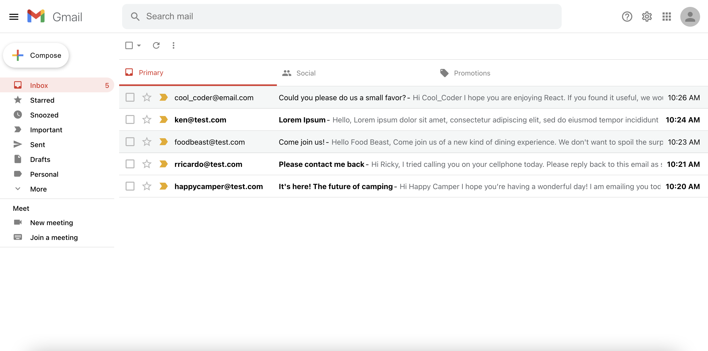

# Google and Gmail Clone

## Description

Need to google something or need to send an email? Find what your looking for with this google clone application built with React.js.

## Table of Contents

- [Description](#description)
- [Technology](#technology)
- [User Story](#user-story)
- [Installation](#installation)
- [Usage](#usage)
- [License](#license)
- [Contributing](#contributing)
- [Tests](#tests)
- [Questions](#questions)
- [Deployed Application URL](#deployed-application-URL)

## Technology

- React.js
- Context API
- React Hooks
- React Router
- React Custom Hooks
- Firebase (hosting, firestore)
- Material UI
- Google API
- CSS
- HTML
- JavaScript

## User Story

## Installation

npm install in root folder to install dependancies

## Usage

The deployed link will take you to the homepage. Enter a word or phrase in the input field and press enter! Also on the homepage, click on gmail to head over to the gmail layout. Click on compose to create an email or click on one of the exisiting messages to view the message. Click on delete to delete the message.

## License

## Contributing

Please follow standard contributing guidelines.

## Tests

No tests to run.

## Questions

For any questions, please contact kendayao at kendayao@gmail.com

## Deployed Application URL

Deployed application link: https://clone-7b90d.web.app/

Video demo link google-search: https://giphy.com/gifs/XRmyOfj9y0PfzKLaHi/fullscreen

Video demo link gmail: https://giphy.com/gifs/EM4RZrY809IRyueDaa/fullscreen

